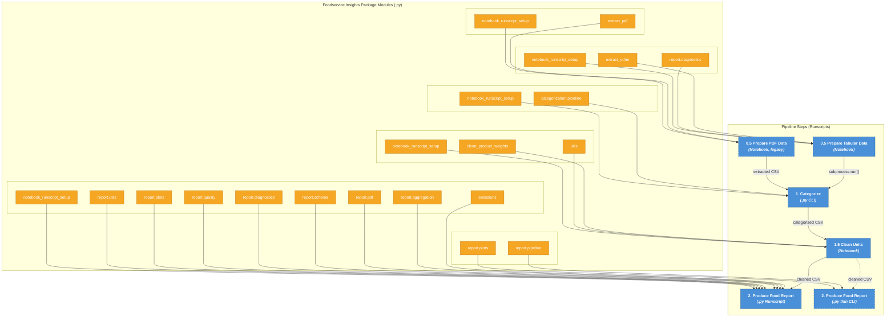

# Foodservice Insights Pipeline Flow

```mermaid
flowchart TB
    %% ── Styling ──
    classDef runscript fill:#4a90d9,stroke:#2c5f8a,color:#fff,font-weight:bold
    classDef module fill:#f5a623,stroke:#c17d1a,color:#fff
    classDef altpath fill:#4a90d9,stroke:#2c5f8a,color:#fff,font-weight:bold,stroke-dasharray:5 5
    classDef invisible fill:none,stroke:none,color:none

    %% ════════════════════════════════════════════
    %% TOP LANE: Pipeline Steps
    %% ════════════════════════════════════════════
    subgraph Steps["Pipeline Steps (Runscripts)"]
        direction LR
        S05_PDF["0.5 Prepare PDF Data<br/><i>(Notebook, legacy)</i>"]:::altpath
        S05["0.5 Prepare Tabular Data<br/><i>(Notebook)</i>"]:::runscript
        S1["1. Categorize<br/><i>(.py CLI)</i>"]:::runscript
        S15["1.5 Clean Units<br/><i>(Notebook)</i>"]:::runscript
        S2["2. Produce Food Report<br/><i>(.py Runscript)</i>"]:::runscript
        S2_CLI["2. Produce Food Report<br/><i>(.py thin CLI)</i>"]:::altpath

        S05 -- "subprocess.run()" --> S1
        S05_PDF -- "extracted CSV" --> S1
        S1 -- "categorized CSV" --> S15
        S15 -- "cleaned CSV" --> S2
        S15 -. "cleaned CSV" .-> S2_CLI
    end

    %% ════════════════════════════════════════════
    %% BOTTOM LANE: Package Modules
    %% ════════════════════════════════════════════
    subgraph Modules["Foodservice Insights Package Modules (.py)"]
        direction LR

        subgraph grp05pdf[" "]
            M_extract_pdf[extract_pdf]:::module
            M_ns_legacy[notebook_runscript_setup]:::module
        end

        subgraph grp05[" "]
            M_extract_other[extract_other]:::module
            M_report_diag_05[report.diagnostics]:::module
            M_nrs_05[notebook_runscript_setup]:::module
        end

        subgraph grp1[" "]
            M_categorize[categorization.pipeline]:::module
            M_nrs_1[notebook_runscript_setup]:::module
        end

        subgraph grp15[" "]
            M_clean_wt[clean_product_weights]:::module
            M_utils[utils]:::module
            M_nrs_15[notebook_runscript_setup]:::module
        end

        subgraph grp2[" "]
            M_emissions[emissions]:::module
            M_agg[report.aggregation]:::module
            M_builder[report.pdf]:::module
            M_contracts[report.schema]:::module
            M_report_diag_2[report.diagnostics]:::module
            M_report_quality[report.quality]:::module
            M_report_plots[report.plots]:::module
            M_report_utils[report.utils]:::module
            M_nrs_2[notebook_runscript_setup]:::module
        end

        subgraph grp2cli[" "]
            M_food_report[report.pipeline]:::module
            M_report_plots_cli[report.plots]:::module
        end

        %% invisible links to keep module groups in order
        grp05pdf ~~~ grp05 ~~~ grp1 ~~~ grp15 ~~~ grp2 ~~~ grp2cli
    end

    %% ════════════════════════════════════════════
    %% CONNECTIONS: Modules → Steps
    %% ════════════════════════════════════════════

    %% 0.5 PDF
    M_extract_pdf --> S05_PDF
    M_ns_legacy --> S05_PDF

    %% 0.5 Tabular
    M_extract_other --> S05
    M_report_diag_05 --> S05
    M_nrs_05 --> S05

    %% 1. Categorize
    M_categorize --> S1
    M_nrs_1 --> S1

    %% 1.5 Clean Units
    M_clean_wt --> S15
    M_utils --> S15
    M_nrs_15 --> S15

    %% 2. Report (Runscript)
    M_emissions --> S2
    M_agg --> S2
    M_builder --> S2
    M_contracts --> S2
    M_report_diag_2 --> S2
    M_report_quality --> S2
    M_report_plots --> S2
    M_report_utils --> S2
    M_nrs_2 --> S2

    %% 2. Report (thin CLI)
    M_food_report --> S2_CLI
    M_report_plots_cli --> S2_CLI
```
